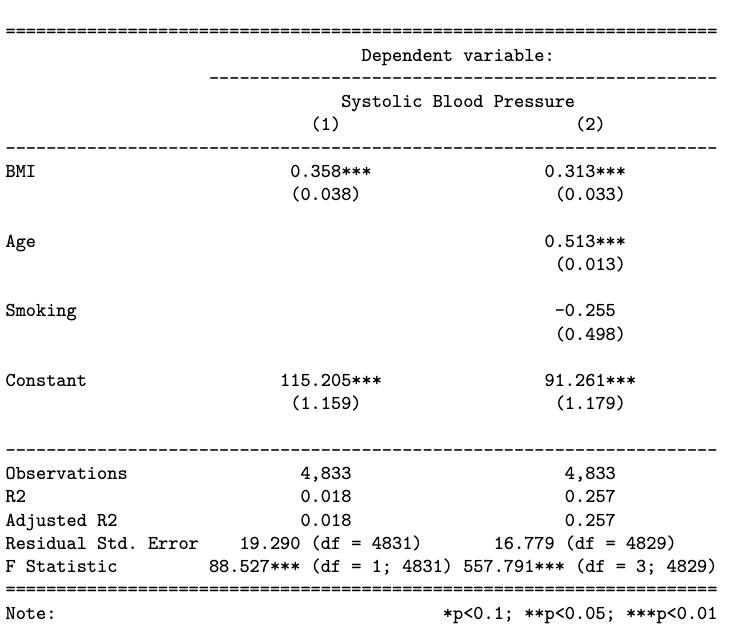

```{r setup, include=FALSE}
library(tidyverse)
library(stargazer)
library(sandwich)
library(here)

df <- read_csv(here("data/processed/nhanes_clean.csv"))
```

## Introduction

Body mass index and blood pressure are two widely used health indicators that are closely linked to cardiovascular risk. Understanding how these measures relate to each other is important for clinicians, public health researchers, and policymakers who aim to better understand patterns in population health. This project focuses on a descriptive question: what is the relationship between body mass index and systolic blood pressure? Rather than making a causal claim or building a predictive model, the goal is to describe the strength and shape of the association between these variables in a large public health dataset. This is particularly relevant because excess body weight is often associated with hypertension, and a clear descriptive analysis can show how blood pressure tends to vary across individuals with different BMI levels.

## Description of Data Source

The analysis uses data from the National Health and Nutrition Examination Survey (NHANES), a publicly available dataset collected by the Centers for Disease Control and Prevention. NHANES combines survey responses, medical examinations, and laboratory data to assess the health and nutritional status of individuals in the United States. The unit of observation in this study is an individual participant. NHANES is well suited for this analysis because it is cross-sectional, includes a large number of observations, and provides directly measured variables for both body mass index and systolic blood pressure. These features make it appropriate for a descriptive regression analysis of the relationship between BMI and blood pressure.

## Data Wrangling

The final dataset was created by combining multiple NHANES component files, including demographic data, body measurements, blood pressure readings, and smoking-related variables. These files were merged using the respondent identifier SEQN, which uniquely links individuals across datasets. After merging, only the variables relevant to the analysis were retained: age, body mass index, systolic blood pressure, and smoking status. Observations with missing values in any of these variables were removed to ensure consistency in the regression analysis. The smoking variable was also recoded into a binary indicator to improve interpretability. The resulting dataset contains one observation per participant and is structured for descriptive regression analysis.

## Operationalization

## Data Visualization

## Model Specification

We begin with a simple linear regression model that examines the relationship between body mass index and systolic blood pressure. In this specification, systolic blood pressure is modeled as a function of BMI alone. The purpose of this model is to establish a baseline understanding of the association between these two variables without adjusting for additional factors.

To improve the model, we then extend the specification by including age and smoking status as additional explanatory variables. These variables are included because they are known to influence blood pressure and may also be correlated with BMI. By adding these controls, the extended model provides a more accurate description of the relationship between BMI and blood pressure while accounting for potential confounding factors.


We also wanted to check if the relationship between BMI and blood pressure is really a straight line, or if it curves at higher BMI values. To explore this, we added a squared BMI term (BMI²) to the model along with age and smoking. This lets us see whether the effect of BMI on blood pressure gets stronger as BMI increases, or whether a linear model already captures the shape well enough.

```{r estimate models}
model_one   <- lm(bp ~ bmi, data = df)
model_two   <- lm(bp ~ bmi + age + smoking, data = df)
model_three <- lm(bp ~ bmi + I(bmi^2) + age + smoking, data = df)
```

```{r report models, message = FALSE, warning = FALSE, results = 'asis'}
stargazer(
  model_one,
  model_two,
  model_three,
  header = FALSE,
  se = list(
    sqrt(diag(vcovHC(model_one))),
    sqrt(diag(vcovHC(model_two))),
    sqrt(diag(vcovHC(model_three)))
  ),
  type = "latex",
  covariate.labels = c("BMI", "BMI Squared", "Age", "Smoking", "Intercept"),
  digits = 2,
  omit.stat = c('ser', 'f'),
  star.cutoffs = c(0.1, 0.05, 0.01),
  title = "Regression Results: BMI and Systolic Blood Pressure",
  dep.var.labels = "Systolic Blood Pressure (mmHg)"
)
```




## Model Assumptions

The assumptions of the linear regression models were evaluated using standard residual diagnostics for both the simple model (BMI only) and the extended model including age and smoking. In both specifications, the residuals versus fitted values plots show that residuals are generally centered around zero without strong nonlinear patterns, suggesting that the linearity assumption is reasonable. However, there is some evidence of increasing spread in the residuals at higher fitted values, indicating mild heteroscedasticity.

The distribution of residuals appears approximately normal in both models. The histograms show a roughly bell-shaped distribution, and the Q-Q plots indicate that residuals closely follow the theoretical normal line in the central region, with some deviations in the tails. These deviations suggest that normality is not perfectly satisfied, but given the large sample size, they are unlikely to substantially affect the validity of the estimates.

Comparing the two models, the extended model shows a slight improvement in residual behavior, with reduced spread and better overall fit. This suggests that including age helps explain additional variation in blood pressure. 

For Model 3, the residual pattern looks very similar to Model 2 — adding BMI² did not meaningfully change the distribution of residuals or reduce the spread, which lines up with the finding that the BMI² term was not statistically significant. Overall, while some assumptions are only approximately satisfied, the models provide a reasonable and credible descriptive approximation of the relationship between BMI and blood pressure.


## Model Results and Interpretation

The simple linear regression model shows a positive and statistically significant relationship between body mass index and systolic blood pressure. The estimated coefficient for BMI indicates that a one-unit increase in BMI is associated with an average increase of approximately 0.36 mmHg in systolic blood pressure. While this relationship is statistically significant, the magnitude of the effect is relatively small, suggesting that BMI alone has limited practical impact on blood pressure. This is further supported by the low R-squared value of approximately 0.018, indicating that BMI explains only a small fraction of the variation in blood pressure.

When the model is extended to include age and smoking status, the explanatory power increases substantially, with the R-squared rising to approximately 0.26. In this specification, BMI remains statistically significant, although its estimated effect decreases slightly, suggesting that part of the association observed in the simple model is explained by other variables, particularly age. Age shows a strong and statistically significant positive relationship with blood pressure, indicating that it is a key factor in explaining variation in the outcome. Smoking status, however, does not appear to have a statistically significant effect in this model. Overall, the results suggest that while BMI is associated with blood pressure, its effect is modest compared to other factors such as age.

In Model 3, adding a BMI² term did not improve the model — neither the linear nor the squared BMI term is significant (p = 0.59 and p = 0.42, respectively), and the R² barely changes from 25.7% to 25.8%. This suggests the relationship between BMI and blood pressure is essentially linear within the range observed in this dataset, and the more complex polynomial model does not add descriptive value.

## Overall Effect

This analysis finds a consistent, positive association between BMI and systolic blood pressure — higher BMI tends to go with higher blood pressure, and this holds even after controlling for age and smoking. However, the effect is modest: BMI alone explains only 1.8% of the variation in blood pressure, while age turns out to be a much stronger predictor. The polynomial model also showed no meaningful curvature, suggesting the relationship is essentially linear. These findings give a clear descriptive picture of how BMI and blood pressure move together in the U.S. adult population.
